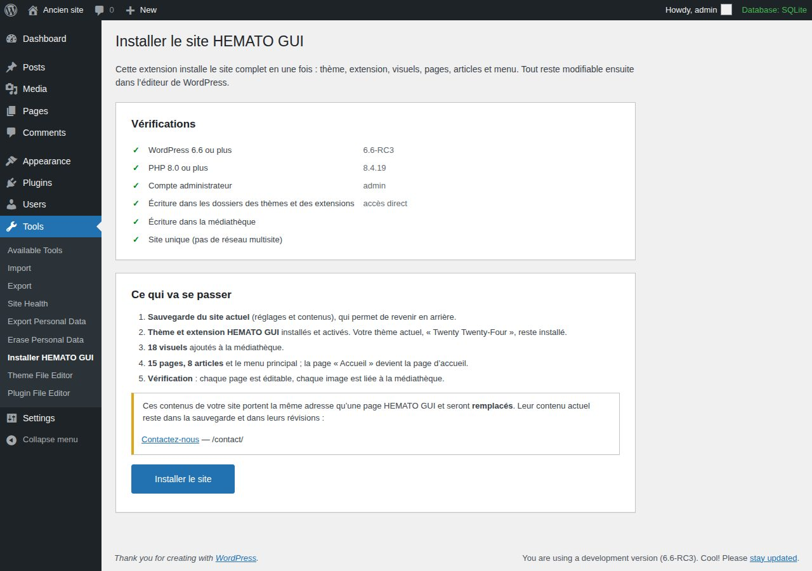
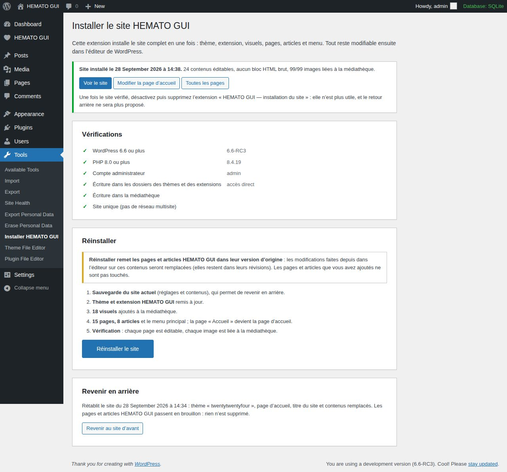

# Mettre le site HEMATO GUI en ligne

Tout le site s'installe depuis l'administration de votre WordPress, avec un seul fichier :
**`hemato-gui-installation.zip`**. Comptez cinq minutes. Votre site actuel est sauvegardé avant
toute modification, et un bouton permet de revenir en arrière.

> Le fichier se reconstruit à tout moment depuis le dépôt avec
> `python3 outils/wordpress/construire.py` (il apparaît dans `dist/`).

## Avant de commencer

- WordPress **6.6 ou plus**, PHP **8.0 ou plus** (Outils › Santé du site › Infos les indique).
- Un compte **administrateur**.
- Par précaution, une sauvegarde complète chez votre hébergeur (la plupart la proposent en un clic).

## Sur WordPress.com (hematogui.com)

- L'offre **Premium** du site permet de téléverser des extensions et des thèmes : rien d'autre à acheter.
- Au premier téléversement d'une extension, WordPress.com active les fonctionnalités d'hébergement
  avancées du site. Cela prend quelques minutes, une seule fois.
- L'extension tient compte de cet hébergement : XML-RPC reste actif (Jetpack en a besoin pour relier
  le site à WordPress.com), et les aperçus de wordpress.com peuvent afficher le site.
- Si la structure des adresses reste datée (`/2026/09/22/…`), les liens vers les articles suivent
  automatiquement leur vraie adresse.
- Contenus existants que l'installation **remplacera** (état au 29 septembre 2026) : « Contact »
  (modèle de 2020 : « 10 Street Road », myemail@example.com), « Drepanocytose » et « Hemophilie »
  (pages vides). Ils restent dans la sauvegarde. La page « DREPANOCYTOSE » rédigée
  (`/drepanocytose-2/`), les anciens articles et le thème Hever ne sont pas touchés.
- La page « Hémopathies Malignes » était déclarée comme page des articles : ce réglage est remis à
  zéro, sinon elle afficherait la liste des articles au lieu de son contenu (le retour arrière le rétablit).

## 1. Téléverser l'extension d'installation

1. *Extensions › Ajouter une extension › Téléverser une extension*.
2. Choisir `hemato-gui-installation.zip`, puis **Installer maintenant**.
3. **Activer l'extension**. La page *Outils › Installer HEMATO GUI* s'ouvre d'elle-même.

## 2. Vérifier, puis installer

- **Vérifications** : toutes les lignes doivent être vertes. Une ligne rouge (droits d'écriture,
  version de PHP) se règle chez l'hébergeur ; l'installation reste bloquée d'ici là.
- **Ce qui va se passer** : si une page de votre site actuel porte la même adresse qu'une page
  HEMATO GUI (par exemple `/contact/`), elle est listée ici. Elle sera remplacée ; son contenu
  reste dans la sauvegarde et dans ses révisions.
- Cliquer sur **Installer le site** et confirmer. Les étapes s'affichent au fur et à mesure :
  sauvegarde, thème et extension, visuels, pages et articles, vérification. Environ une minute.

À la fin, la page indique « Site installé » avec le résultat du contrôle : chaque contenu est
éditable dans WordPress, aucun bloc HTML brut, toutes les images liées à la médiathèque.

## 3. Contrôler le site

- **Voir le site** : accueil, menu *Hématologie*, fiches, articles d'actualité, en ordinateur et sur téléphone.
- **Rendez-vous** : envoyer une demande d'essai depuis la page *Rendez-vous*, puis la retrouver dans
  *HEMATO GUI › Demandes* ; la supprimer ensuite.
- **Courriel de notification** : *HEMATO GUI › Réglages*, renseigner l'adresse qui reçoit les demandes.
- **Menu** : *Apparence › Éditeur › Navigation › Menu principal*.

## 4. Retirer l'extension d'installation

Une fois le site vérifié : *Extensions*, **désactiver** puis **supprimer**
« HEMATO GUI — installation du site ». Elle n'a plus d'utilité, et elle contient une copie des fichiers
du site. Le thème et l'extension « HEMATO GUI — fonctions du site » restent, eux, indispensables.

## En cas de problème

| Message | Que faire |
|---|---|
| « Arrêt : réponse inattendue du serveur… délai d'exécution dépassé ? » | Recliquer sur **Installer le site** : tout ce qui est déjà fait est retrouvé, rien n'est dupliqué. |
| « copie incomplète » ou ligne rouge « Écriture… » | PHP ne peut pas écrire dans `wp-content` : à corriger par l'hébergeur. Autre voie : installer le thème (`hemato-gui-theme.zip`, *Apparence › Thèmes › Ajouter › Téléverser*) et l'extension (`hemato-gui-extension.zip`) à la main, puis relancer. |
| Le site ne vous convient pas | **Revenir au site d'avant**. L'ancien thème, la page d'accueil, le titre et les pages remplacées sont rétablis ; les pages HEMATO GUI passent en brouillon, rien n'est supprimé. |

**Réinstaller** remet les pages et articles HEMATO GUI dans leur version d'origine : les modifications
faites depuis dans l'éditeur sur ces contenus seraient remplacées (elles restent dans leurs révisions).
Les pages et articles que vous avez ajoutés ne sont jamais touchés.

## Mises à jour du thème ou de l'extension

*Apparence › Thèmes › Ajouter › Téléverser* avec `hemato-gui-theme.zip`, ou
*Extensions › Ajouter › Téléverser* avec `hemato-gui-extension.zip`, puis **Remplacer la version installée**.
Vos pages, articles et réglages ne sont pas touchés.

## Après la mise en ligne

- HTTPS actif sur tout le site (certificat gratuit chez la plupart des hébergeurs).
- Double authentification pour les comptes administrateurs et secrétariat.
- Sauvegardes automatiques quotidiennes chez l'hébergeur.
- Aucune information médicale personnelle n'est affichée publiquement : les demandes de rendez-vous
  ne sont visibles que dans l'administration, et le courriel de notification ne contient ni l'identité
  ni le motif.
